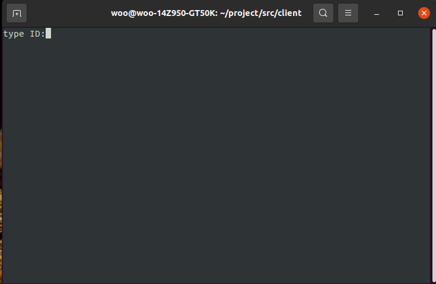

# chat-in-c

<h1>프로젝트 멤버 및 역할</h1>

<h1>프로젝트 소개 및 개발 내용 소개</h1>
이 프로젝트는 터미널 환경에서의 채팅 프로그램 입니다. 
파일을 서버로 올리고 다른 클라이언트가 서버에 있는 파일을 내려 받을 수 있습니다. 
오픈소스 인 imcat 을 이용해서 터미널 환경에서 이미지 파일을 볼 수 있습니다. 
<h1>프로젝트 개발 결과 소개</h1>
#server.c
<ul>
  <li>send_msg()-모든 클라이언트 들에게 메세지를 전송하는 함수 명령어를 확인하고 처리한다.</li>
  <li>handle_cli()-클라이언트로 부터 메세지를 받고 클라이언트가 종료하면 소켓을 지운다</li>
  <li>client_cnt-클라이언트의 갯수 변수</li>
  <li>client_sockets-클라이언트의 소켓번호를 저장하는 배열</li>
  </ul>
 #client.c
 <ul>
  <li>ID-클라이언트의 닉네임 변수</li>
  <li>msg-클라이언트가 보내는 메세지</li>
  <li>send_msg()-서버로 메세지를 전송한다</li>
  <li>recv_msg()-서버로 부터 메세지를 받는다.</li>
  </ul>
  
  
  /send [fileanme]- 클라이언트가 가지고 있는 파일을 서버로 전송한다. 
  /down [filename]-서버가 가지고있는 파일을 클라이언트로 전송 한다. 
  /view [filename]-클라이언트가 가지고있는 이미지 파일을 출력한다. 
  
  <h1>개발결과물 사용방법</h1>
  
  </img>
